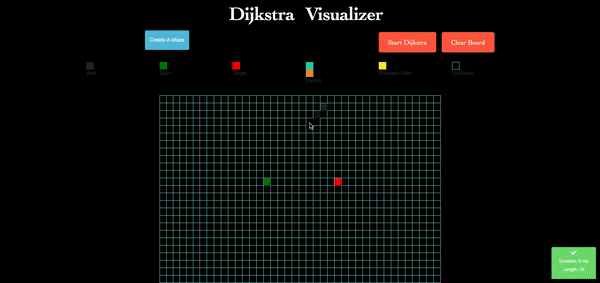

# AddisMap Shortest Path Finding 

# Introduction

This project was inspired by my desire to learn different path finding algorithms.

Pathfinding algorithms are an attempt to solve the shortest path problem in graph theory. They try to find the best path given a starting point and ending point based on some predefined criteria. In graph theory, the shortest path problem is the problem of finding a path between two vertices (or nodes) in a graph such that the sum of the weights of its constituent edges is minimized.

I grew up in Addis Ababa, Ethiopia in the subcity Gerji. Growing up, I realized that people go around to places using landmarks such as historical buildings or statues... and nobody really uses nagivation or GPS on their map. This is in stark contrast to how people move around in New York City or any developed country. 

There are a variety of reasons for why this is. 

First, **Internet in Ethiopia** is very expensive and most people can't afford to use their data on navigation and most people don't even have a smartphone.

Second, the navigation apps such as Google Maps don't really give the shortest path as they rely mostly on roads and there are a majority of roads in Ethiopia that aren't recognized as roads and there are alot of shortcuts people use that don't appear on Google Maps.

I created this app initally for the area where I grew up and went to school (Gerji, Addis Ababa). I wanted to see if the shortest path that was calculated was the path my parents and I usually used. 

## Choosing The Marker

This application allows you to set two markers on the google map API (Start, Destination). The Markers are defined by (S) for the start and a (FLAG) for the destination. The scope of the map area is in the sub city (GERJI) I grew up in. (I will add a couple other areas soon, ==> Queens, NY around St John's University and Berlin, Germany around Berlin International School)

After choosing the markers, the latitude and longitude are stored and you are able to set the path finding algorithm (Breadth First Search, Depth First Search, Dijkstra, Greedy First Search, A-Star...) and it will use that algorithm for you to find the path.

## Shortest Path

**Example Path Finding Using A-Star Algorithm**

## Visualizer

**If you scroll down, you can also see a visualizer of the algorithm! I feel that the visualizers are really important for understanding how these algorithms work. You can set mazes, block walls and understand how an algorithm finds the shortest path.**

## Path Comparision To Google API Directions

## HOW TO CLONE AND USE THIS PROJECT:

* Clone this project (https://github.com/yohannes15/AddisMap.git)
* Make sure to have Python Installed (Python3 preferably)
* Make sure to have Django Installed (Django 3.0.7 preferably)
* Make sure to have a Google API Key in order to work with Google Javascript Map API that is being used on this project. After getting the key, go to the mapvis/views.py file and change the GMAPS_KEY in the contexts of all the views which make use of the map.
* You basically have a working project now.

## THE DATA

The data for this map is extracted from OpenStreetMap. If you would like to work with a different part of the world/city/neighborhood, you need to extract it from OpenStreetMap and change the gerji.OSM file. If you are going to download a very metropoltian area such as New York or any other major city, just know that the most of the algorithms will take a much longer time. The Gerji.OSM file I have has over 100,000 nodes and it takes a couple seconds for the algorithm to run on the slower path finding algorithms. So just be mindful of that!

## FILES

* **adjacency.py** --> creates an adjacency list which represents the overall graph. It is a dictionary of dictionaries. 
**FORMAT** is like this: {nodeID: {neighborNode: distance(using harversine formula), anotherNeighborNode: distance, ...}, nodeID: {neighborNode: distance, ...}}

* **algorithms.py** --> has useful function such as harversine formula which finds the distance between two points on earth taking into account earth's curvature. It also has a closestNode finder which finds the closest Node to a chosen node. (This is helpful if someone selects a marker(node) that has no neighboring node. Instead of saying NO PATH FOUND, it would find the closet node to it and try to find a path based on that node). Also has Dijkstra path finding algorith

* **a_star.py** --> Implementation of A Star Search using a heap based priority queue. **The herustic** is the distance from the target (destination) node. It is admissible and never overestimates, so it is pretty accurate and fast. I am looking for maybe a better herustic, and that is my next improvment for this algorithm.

* **extract.py** --> Parses the supplied OSM file for extracting the nodes and the edges for the graph. 

* **parser.py [CREDIT TO: Henke Adolfsson]** --> a class that can parse OpenStreetMap Node-data and OpenStreetMap Way-data. There is a helper function for retrieving a default parser called get_default_parser(fname). It provides a basic parser that can iterate over nodes and iterate over ways If you want to tweak the behaviour of the default parser you can change the tags that will be returned with the tuples DEFAULT_NODE/WAY_TAGS under the Module Config-section. 

  * The default parser will return edges with tags if they exist in "DEFAULT_WAY_TAGS". You can tweak the behaviour of the default parser so that it will return
  all tags it encounters. You do this by calling 'get_default_parser(fname, allow_all=True)'
  
* **store.py** --> Defines the classes for how the Nodes and Edges are represented and stored.

* **tests.py** --> Unit tests. Right now, it is only a test class for the Nodes and Edges, but I am working on adding as much tests as possible for the algorithms.

**THE OTHER FILES ARE DJANGO SPECIFIC APPS, WHICH YOU CAN LEARN FROM THE WONDERFUL DJANGO DOCS. **

